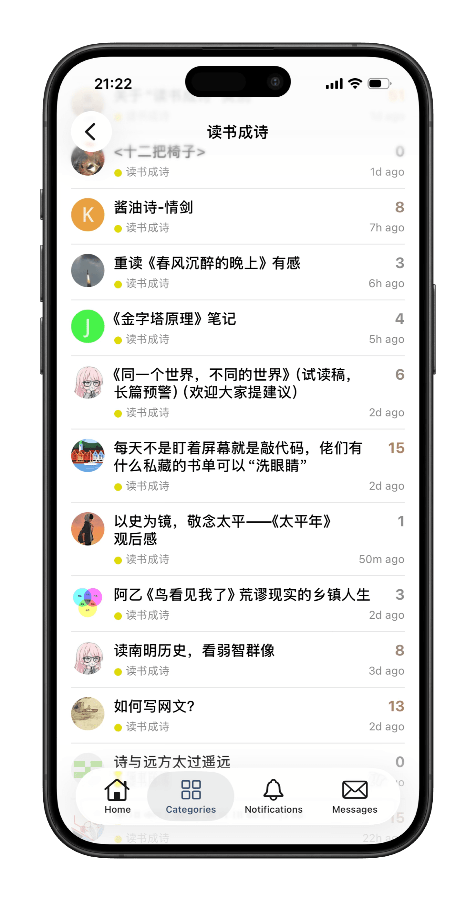
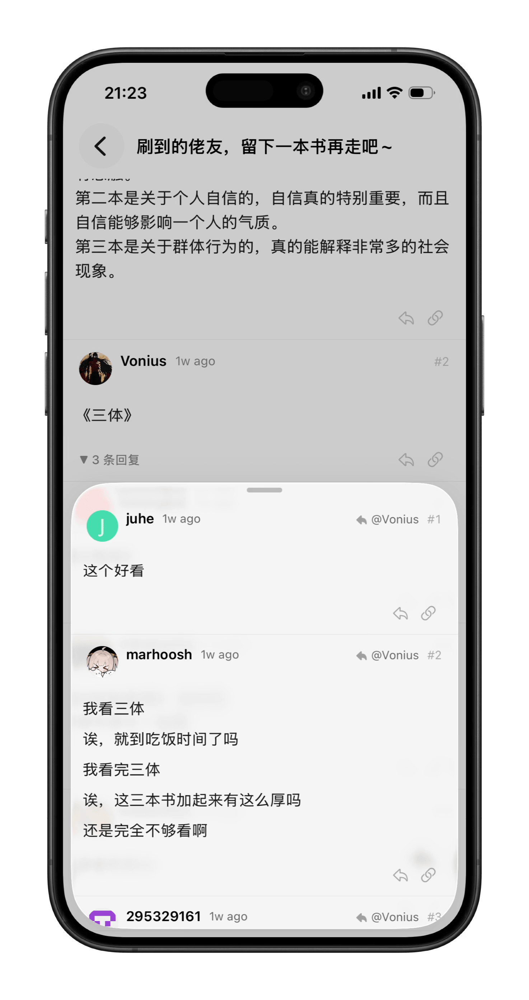
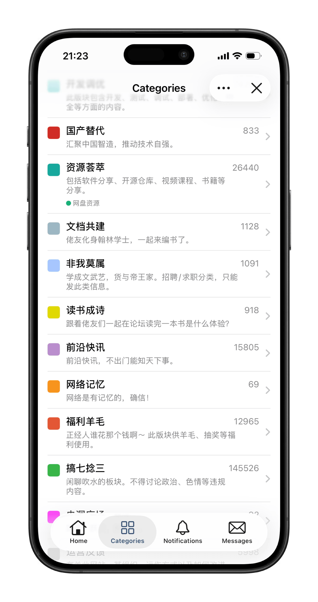

<p align="center">
  
</p>

<h1 align="center">Dexo</h1>

<p align="center">A native iOS client for Discourse forums, built with UIKit + Swift.</p>

<p align="center">
  English | <a href="README.zh-CN.md">中文</a>
</p>

## Screenshots

| Home  | Topic Detail | Categories |
|:---:|:---:|:---:|
|  |  |  |


## Features

- [x] **Multi-Forum Management** — Add, switch, and remove multiple Discourse instances
- [x] **Topic Browsing** — Latest / Top topic lists with infinite scrolling
- [x] **Categories & Tags** — Browse topics by category or tag
- [x] **Topic Detail** — HTML content rendering, image viewer, code blocks, collapsible sections
- [x] **Reply** — Reply to topics or to specific posts
- [x] **Secure Auth** — Web session login with cookie reuse for native requests
- [x] **Appearance** — System / Light / Dark mode
- [ ] **Notifications & Messages** — View forum notifications and private messages
- [ ] **Create Topic** — Publish new forum topics

## Tech Stack

| Component | Detail |
|-----------|--------|
| Language | Swift 5 |
| UI Framework | UIKit |
| Minimum Target | iOS 15.0 |
| Architecture | MVVM + `DexoObservableObject` |
| Build Tool | [Tuist](https://tuist.dev) |
| Database | SQLite ([GRDB](https://github.com/groue/GRDB.swift)) |
| Networking | [Alamofire](https://github.com/Alamofire/Alamofire) |
| Image Loading | [SDWebImage](https://github.com/SDWebImage/SDWebImage) |
| Image Viewer | [Lightbox](https://github.com/hyperoslo/Lightbox) |

## Getting Started

### Prerequisites

- Xcode 16+
- [mise](https://mise.jdx.dev) (runtime version manager)

### Build

```bash
# Install tools, fetch dependencies, and generate the Xcode project
make setup

# Re-generate the project only
make generate

# Clean
make clean
```

Open the generated `dexo.xcodeproj`, select your development team, then build and run.

## Project Structure

```
dexo/
├── Core/
│   ├── Auth/           # Auth flow, Keychain, RSA encryption
│   ├── Networking/     # DoH URLProtocol
│   ├── Observable/     # ObservableViewController base class
│   └── Settings/       # App preferences
├── Database/           # GRDB database manager & models
├── Features/
│   ├── ForumList/      # Forum list
│   ├── ForumDetail/
│   │   ├── Home/       # Latest / Top topics
│   │   ├── Categories/ # Category browsing
│   │   ├── Tags/       # Tag-based browsing
│   │   ├── Messages/   # Private messages
│   │   ├── Notifications/ # Notifications
│   │   └── TopicDetail/   # Topic detail & replies
│   └── Settings/       # Settings
├── Networking/
│   ├── DiscourseAPI.swift    # API client
│   ├── DiscourseRouter.swift # Route definitions
│   └── Models/               # API response models
└── Assets.xcassets/
```

## Links

- **[Linux.do](https://linux.do)**
