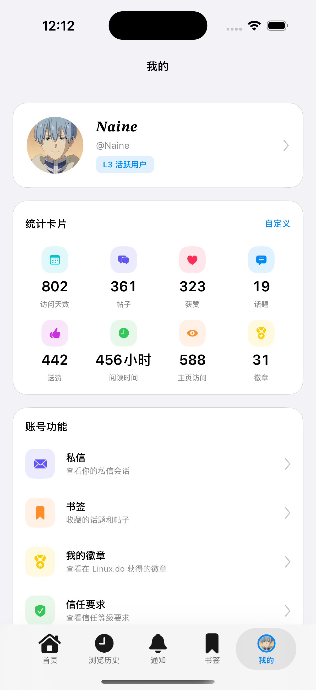

<p align="center">
  
</p>

<h1 align="center">DexoFlux</h1>

<p align="center">一个原生 iOS Linux 论坛客户端，使用 UIKit + Swift 构建。</p>

<p align="center">
  <a href="README.md">English</a> | 中文
</p>

## 截图

| 论坛首页 | 帖子详情 | 我的 |
|:---:|:---:|:---:|
|  |  |  |

## 功能

- [x] **Linux.do 浏览** — 原生浏览最新话题、热门话题、板块、标签和搜索结果。
- [x] **帖子详情** — 原生渲染 cooked HTML，支持正文、图片、引用、代码块、投票、折叠、Onebox、表格、视频和时间线。
- [x] **回复与互动** — 支持回复主题、回复楼层、点赞，以及 Linux.do 表情 / boost 互动。
- [x] **图片查看** — 内容区和评论区多图预览，支持左右滑动、图片数量、分享、保存和关闭。
- [x] **我的页面** — 个人看板、头像 / 名称缓存、书签、浏览历史、通知和私信。
- [x] **安全认证** — Web 登录、Cookie 复用原生请求，并支持全局 Cloudflare 盾牌处理。
- [x] **外观设置** — 默认、小红书、Telegram、护眼主题色，以及应用图标、自定义字体、全局字号、内容区字号和底栏设置。
- [x] **数据管理** — 查看并清理浏览数据、图片缓存、Cookie 和应用存储。

## 技术栈

| 项目 | 说明 |
|------|------|
| 语言 | Swift 5 |
| UI 框架 | UIKit |
| 最低版本 | iOS 15.0 |
| 架构 | MVVM 风格 ViewModel + `DexoObservableObject` / 可观察 ViewController |
| 构建工具 | [Tuist](https://tuist.dev) |
| 网络 | [Alamofire](https://github.com/Alamofire/Alamofire)、自定义 Router、Cookie 复用请求、DoH URLProtocol |
| Web 会话 | `WKWebView` 负责登录、Cloudflare 验证和会话刷新 |
| 数据库 | SQLite via [GRDB](https://github.com/groue/GRDB.swift) |
| HTML 渲染 | 本地 `CookedHTML` 包，底层使用 [SwiftSoup](https://github.com/scinfu/SwiftSoup) |
| 图片加载 | [SDWebImage](https://github.com/SDWebImage/SDWebImage) + [SDWebImageSVGCoder](https://github.com/SDWebImage/SDWebImageSVGCoder) |
| 图片查看 | [Lightbox](https://github.com/hyperoslo/Lightbox) + 自定义多图预览 UI |
| 持久化 | Keychain、Cookie、本地设置、GRDB 模型 |

## 快速开始

### 前置要求

- Xcode 16+
- [mise](https://mise.jdx.dev) 用于工具版本管理

### 构建

```bash
# 安装工具、拉取依赖、生成 Xcode 工程
make setup

# 只重新生成工程
make generate

# 清理生成产物
make clean
```

执行完成后打开生成的 `dexoflux.xcodeproj`，选择开发团队后即可编译运行。

## 项目结构

```text
dexo/
├── AppDelegate.swift
├── Core/
│   ├── Auth/                 # Web 登录、Cookie、Keychain、会话刷新
│   ├── ImageLoading/         # 头像和图片加载工具
│   ├── Observable/           # 可观察基类控制器和状态绑定
│   └── Settings/             # 应用设置、主题、语言、字体、底栏偏好
├── Database/
│   └── Models/               # GRDB 数据库管理和持久化模型
├── Features/
│   ├── ForumDetail/
│   │   ├── Home/             # 话题列表和话题卡片
│   │   ├── Categories/       # 板块浏览
│   │   ├── Tags/             # 标签浏览
│   │   ├── TopicDetail/      # 原生帖子详情渲染、回复、图片预览、投票
│   │   ├── Me/               # 个人资料、书签、历史和看板
│   │   ├── Notifications/    # 论坛通知
│   │   ├── Messages/         # 私信
│   │   └── Search/           # 搜索和结果页
│   ├── Main/                 # 主底栏容器和入口路由
│   └── Settings/             # 外观、阅读、数据、网络、底栏设置
├── Networking/
│   ├── DoH/                  # DNS-over-HTTPS URLProtocol 支持
│   ├── Models/               # API 响应模型
│   ├── DiscourseAPI.swift    # Linux.do / Discourse API 客户端
│   └── DiscourseRouter.swift # 路由定义
├── Assets.xcassets/          # App 运行时资源
└── Localizable.xcstrings     # 简体中文、繁体中文和英文文案

Packages/
└── CookedHTML/               # 本地 HTML 解析和原生渲染模型包

assets/                       # README 截图和仓库图片
```

## 致谢

DexoFlux 是在 Dexo 的原生 UIKit 基础上继续探索的二开项目，同时参考了 FluxDo 在交互节奏和视觉风格上的方向。Dexo 和 FluxDo 都是很优秀的应用：前者提供了扎实的 iOS 原生架构基础，后者带来了更顺滑、更现代的论坛浏览体验。DexoFlux 希望把两者的优点揉在一起，做成更适合 Linux.do 的原生客户端。

## 项目链接

- **[Linux.do](https://linux.do)** — DexoFlux 面向的社区。
- **[Eilgnaw/dexo](https://github.com/Eilgnaw/dexo)** — Dexo。
- **[Lingyan000/fluxdo](https://github.com/Lingyan000/fluxdo)** — FluxDo。
