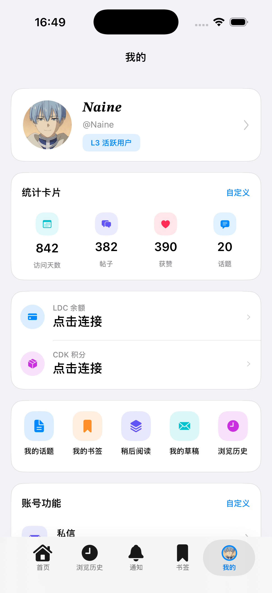

<p align="center">
  
</p>

<h1 align="center">Doer</h1>

<p align="center">原生 iOS Linux.do 客户端，使用 UIKit + Swift 构建。</p>

<p align="center">
  <a href="README.md">English</a> | 中文
</p>

<p align="center">
  <a href="https://github.com/moliango/doer"></a>
  
  
  
</p>

## 截图

| 论坛首页 | 帖子详情 | 我的 |
|:---:|:---:|:---:|
|  |  |  |

## 功能

- [x] **Linux.do 浏览** — 原生浏览最新话题、热门话题、板块、标签和搜索结果。
- [x] **帖子详情** — 原生渲染 cooked HTML，支持正文、图片、引用、代码块、投票、折叠、Onebox、表格、视频和时间线跳转。
- [x] **回复与互动** — 回复主题 / 楼层、点赞，以及 Linux.do 表情 / Boost。
- [x] **图片查看** — 多图预览，支持左右滑动、数量、分享、保存和关闭。
- [x] **我的页面** — 个人看板、勋章、书签、草稿、浏览历史、通知和私信。
- [x] **安全认证** — Web 登录、Cookie 复用原生请求，以及全局 Cloudflare 盾牌处理。
- [x] **外观设置** — 默认、护眼、小红书、Telegram 主题色，以及字体、字号和底栏布局。
- [x] **插件** — 小程序、NewAPI 签到、工具箱和插件坞。
- [x] **分享与小组件** — 把话题链接分享进 Doer，以及主屏幕快捷入口。
- [x] **数据管理** — 查看并清理浏览数据、图片缓存、Cookie 和应用存储。
- [x] **应用更新** — 对照 [GitHub Releases](https://github.com/moliango/doer/releases) 检查新版本。

## 技术栈

| 项目 | 说明 |
|------|------|
| 语言 | Swift 5 |
| UI 框架 | UIKit（主 App 不使用 SwiftUI） |
| 最低版本 | iOS 15.0 |
| Bundle ID | `com.naine.doer` |
| 架构 | MVVM 风格 ViewModel + `DexoObservableObject` / 可观察 ViewController |
| 构建工具 | [Tuist](https://tuist.dev)，通过 `mise` 固定版本 |
| 网络 | [Alamofire](https://github.com/Alamofire/Alamofire)、自定义 Router、Cookie 复用请求、DoH URLProtocol |
| Web 会话 | `WKWebView` 负责登录、Cloudflare 验证和会话刷新 |
| 数据库 | SQLite via [GRDB](https://github.com/groue/GRDB.swift) |
| HTML 渲染 | 本地 `CookedHTML` 包，底层使用 [SwiftSoup](https://github.com/scinfu/SwiftSoup) |
| 图片加载 | [SDWebImage](https://github.com/SDWebImage/SDWebImage) + [SDWebImageSVGCoder](https://github.com/SDWebImage/SDWebImageSVGCoder) |
| 图片查看 | [Lightbox](https://github.com/hyperoslo/Lightbox) + 自定义多图预览 |
| 持久化 | Keychain、Cookie、本地设置、GRDB 模型 |

## 快速开始

### 前置要求

- Xcode 16+
- [mise](https://mise.jdx.dev) 用于工具版本管理

### 构建

```bash
# 安装工具、拉取依赖、生成 Xcode 工程
make setup

# 只重新生成工程
make generate

# 清理生成产物
make clean
```

完成后打开 **`Doer.xcworkspace`**（不要只开单独的 `.xcodeproj`），Scheme 选 **Doer**，再选择开发团队即可编译运行。

生成的 workspace 不入库。改过 `Project.swift` 后需要再跑一次 `make generate`。

## 项目结构

```text
.
├── Project.swift                 # Tuist 工程：Doer / DoerTests / DoerShare / DoerWidget
├── Tuist/                        # 外部 Swift 依赖
├── dexo/                         # App 源码
│   ├── AppDelegate.swift
│   ├── SceneDelegate.swift
│   ├── Info.plist
│   ├── Localizable.xcstrings     # en / zh-Hans / zh-Hant / zh-HK
│   ├── Assets.xcassets/          # 应用图标、启动图、运行时图片
│   ├── Core/
│   │   ├── Auth/                 # Web 登录、Cookie、Keychain、会话刷新
│   │   ├── ImageLoading/         # 头像和图片加载
│   │   ├── Observable/           # 可观察基类控制器
│   │   ├── Plugins/              # 插件注册和内置插件
│   │   ├── Settings/             # 主题、语言、字体、底栏、DoH
│   │   └── Update/               # GitHub Release 检查更新
│   ├── Database/                 # GRDB 和 ForumInstance
│   ├── Features/
│   │   ├── ForumDetail/          # 首页、帖子、我的、通知、搜索、聊天
│   │   ├── ForumList/            # 多论坛列表
│   │   ├── Settings/             # 外观、阅读、数据、网络、关于
│   │   ├── Plugins/              # 小程序、NewAPI 签到、工具箱
│   │   ├── Notion/               # Notion 话题同步
│   │   └── AIModelService/       # 应用内 AI 服务
│   └── Networking/               # DiscourseAPI + DiscourseRouter + DoH
├── Extensions/
│   ├── DexoShare/                # 分享扩展 → doer://
│   └── DexoWidget/               # 主屏幕小组件
├── Packages/CookedHTML/          # cooked HTML → 原生节点树
├── dexofluxTests/                # 单元测试（DoerTests）
├── ci_scripts/                   # 未签名 IPA 构建
└── assets/                       # README 图标和截图
```

## 致谢

Doer 是面向 Linux.do 的原生 iOS 客户端。UIKit 架构来自 Dexo，部分交互节奏参考 FluxDo。产品名和仓库已经独立。

## 项目链接

- **[moliango/doer](https://github.com/moliango/doer)** — 本仓库。
- **[Linux.do](https://linux.do)** — Doer 面向的社区。
- **[Eilgnaw/dexo](https://github.com/Eilgnaw/dexo)** — Dexo。
- **[Lingyan000/fluxdo](https://github.com/Lingyan000/fluxdo)** — FluxDo。
